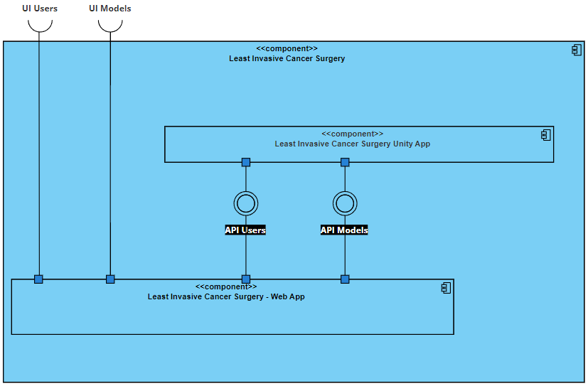

# Least Invasive Breast Cancer Surgery (LIBCS)

Unity project that explores the integration of photoacoustic technology to visualize and analyze breast tumours in a virtual environment. The aim is to develop an interactive platform to facilitate early detection and monitoring of tumors, contributing to advances in the diagnosis and treatment of breast cancer. The breast anatomy models are processed in the web app developed in Angular (app) in conjunction with a NodeJS API (models and users).

## Part Developed in Unity
Due to the size of the Unity project, the complete source code is not present in this repository. Instead, a brief demonstration and description of the Unity project are available [here](unity.md).
## Non Functional Requirements
[Here](wiki/requirements/non-functional/non-functional-requirements.md)

## Functional requirements

## Architecture

The proposed solution is divided into two main parts: the web app and the software in Unity for the HoloLens 2. The web app has been developed with a backend in Node.js using the Onion architecture and a frontend using the Angular framework. Deployment has been carried out for both parts. The data is stored in a MongoDB database, enabling efficient management of large volumes of medical information.

### Level 1
#### Logical View

### Level 2
#### Implementation View

#### Logical View

#### Logical View - Master data

#### Physical View

### Level 3
#### Implementation View - Backend

#### Implementation View - Frontend

#### Logical View - Backend

#### Logical View - Frontend
