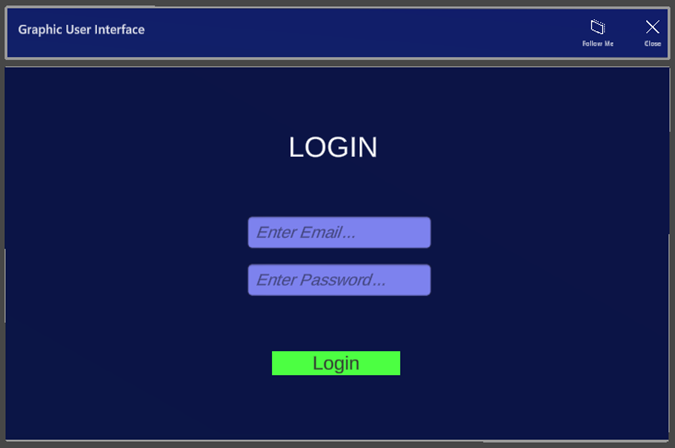
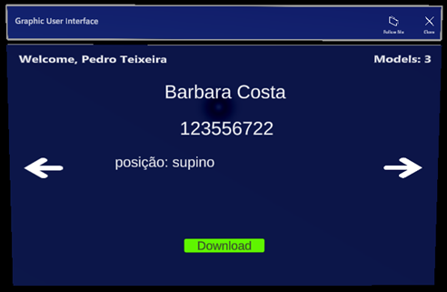
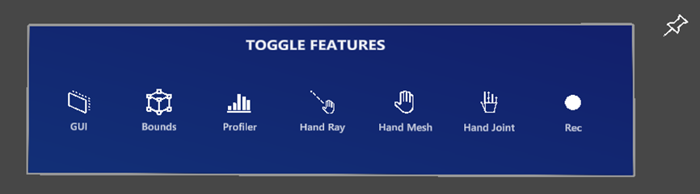
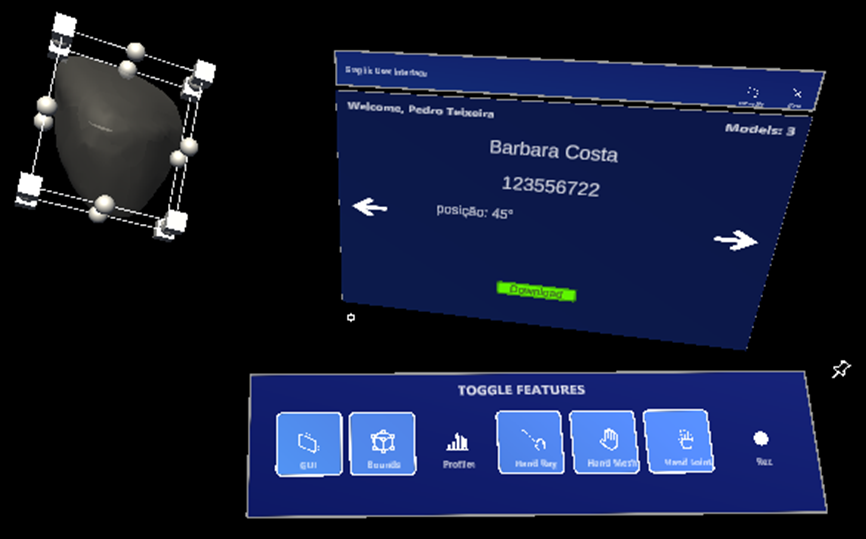

# Unity Project Demonstration

This document provides a brief demonstration and description of the part of the project developed in Unity for the augmented reality application intended for HoloLens 2. The solution aims to assist surgeons in performing less invasive surgeries by allowing real-time visualization of 3D models of patients' breasts, integrating data from various medical imaging modalities such as mammograms, ultrasounds, and photoacoustic images.

## Context

The Unity-developed part is a crucial component of the project, enabling the integration of 3D models in an augmented reality environment to improve the accuracy and efficiency of surgical procedures. Due to the significant size of the Unity project, it was not possible to include it directly in this repository. However, this documentation provides an overview of what was implemented, as well as instructions for viewing a demonstration of the project.

## Demonstration

### Login interface

### Model Visualisation Interface for the Doctor

### Creating a tool panel

### Placing Selected Models in the AR Environment

